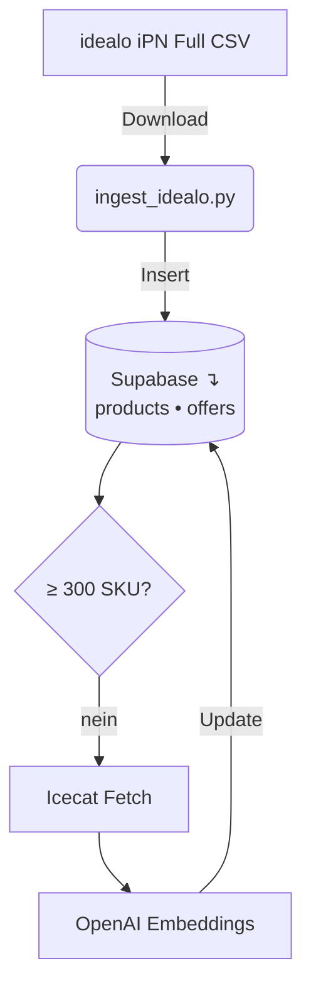

# Whitegoods Chat – Konversationaler Preisberater *(Arbeitstitel)*

> Hilft deutschen Verbraucher\:innen, die passende **Waschmaschine** zum besten Preis zu finden – auf Basis des idealo iPN CSV‑Feeds, Icecat‑Spezifikationen und Vektorsuche.

---

## Worum geht’s?

Whitegoods Chat ist ein Open‑Source‑Proof‑of‑Concept, das Rohdaten aus dem E‑Commerce in einen Dialog‑Assistenten verwandelt. Nutzer stellen Fragen – *„Welche Frontlader bis 600 € sind leise?“* – und erhalten Preise, Produktmerkmale sowie einen Deep‑Link zur entsprechenden **idealo.de**‑Produktseite.

### Kernelemente

* **Aktuelle Preise** – nächtlicher Import des *Full CSV*-Feeds von idealo (DE)
* **Reichhaltige Produktdaten** – Hero‑Bilder & 300+ Icecat‑Attribute pro SKU
* **Vektorsuche** – OpenAI *text‑embedding‑3‑small* (`384‑D`) in Postgres
* **Datenschutz by Design** – keine Screenscraper, keine personenbezogenen Daten

---

## Tech‑Stack (Kurzüberblick)

| Ebene         | Tool / Dienst                       | Stichpunkte                                                |
| ------------- | ----------------------------------- | ---------------------------------------------------------- |
| Frontend      | Next.js 14, shadcn/ui, Tailwind CSS | Responsive Chat‑UI & Produktkarten                         |
| Backend       | FastAPI                             | Endpunkte für Scoring & Anreicherung                       |
| Datenbank     | Supabase Postgres                   | Tabellen `products`, `offers`, `stores` + Embedding‑Spalte |
| Ingest Worker | Python 3.12 (`ingest_idealo.py`)    | CSV‑Download, Filter „Waschmaschine“, Inserts              |
| Anreicherung  | Icecat API                          | Spezifikationen & Bilder (≤ 1 Req/s)                       |
| Embeddings    | OpenAI                              | Kostenlimit ≤ 5 € pro Batch                                |
| CI / CD       | GitHub Actions                      | Nächtlicher Cron `0 2 * * *` Europe/Berlin                 |

---

## Datenfluss (Phase 1)

*Mermaid‑Diagramme werden von GitHub gerendert.*

---

## Roadmap

* [x] **Phase 0** – Öffentliches Repo & README 🎉
* [ ] **Phase 1** – Datenfundament (laufend)
* [ ] **Phase 2** – UI‑Feinschliff & Produktgrid
* [ ] **Phase 3** – Monetarisierung & Nutzer‑Tests

---

## Datenschutz & Compliance

Wir nutzen **ausschließlich** offiziell bereitgestellte CSV‑Feeds / APIs.
Es findet kein Crawlen von idealo‑Webseiten statt. Preise werden lokal für maximal 24 h zwischengespeichert und gemeinsam mit einem Direktlink zu idealo angezeigt. Personenbezogene Daten werden nicht gespeichert (DSGVO Art. 6 (1) f).

---

*Hinweis: Projektname, Domains und Markenauftritt sind noch nicht final und können sich ändern.*
